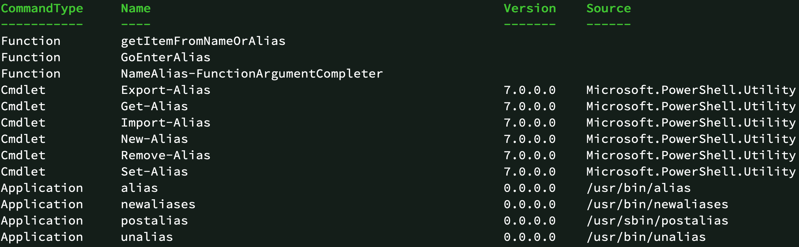

# PowerShell Befehle

PowerShell Befehle werden **Cmdlets** bezeichnet.

Reine PowerShell Cmdlets haben den Aufbau **Verb-Substantiv**. Befehle die diesem Aufbau nicht folgen sind entweder ältere Cmd-Befehle (wie `ping`), Befehle andere Terminals (z.B. bash Befehl `ls`) oder Aliase von Cmdlets.

## Aliase

Die meisten Cmdlets besitzt ein oder mehrere Alias um die Eingabe zu vereinfachen. So kann z.B. für `Get-ChildItem` auch einfach nur `gci` oder `dir` eingegeben werden.

Zu welchen Cmdlet ein Alias gehört kann mittels `Get-Alias` herausgefunden werden.

`Get-Alias <Alias>` 👉 z.B.
```ps
Get-Alias dir
```

Andersherum, welche Aliase ein Cmdlet besitzt ebenfalls mit `Get-Alias` unter Verwendung des Parameters `-Definition`.

`Get-Alias -Definition <Cmdlet>` 👉 z.B.
```ps
Get-Alias -Definition Get-ChildItem
```

---
Es ist auch möglich eigene Alias für vorhandene Cmdlet zu erstellen. Es können jedoch KEINE Alias für komplette Cmdlet mit Parameter erstellt werden!

Hierfür gibt es 2 Cmdlets:

`New-Alias` : Zum erstellen eines **neuen** Aliases. Sollte dieser bereits existieren, gibt es einen Fehler.<br />
`Set-Alias` : Zum erstellen **oder** ändern eines Aliases. Hier werden bereits vorhandene Aliase überschrieben.

Beide haben die Möglichkeiten Beschreibungen, Optionen, Scopes und andere Parameter für den Alias zu erstellen. Der einfache Syntax ist jedoch: `New-Alias <AliasName> <CmdletName>` (für `Set-Alias` der Gleiche).

👉 z.B.
```ps
New-Alias Inhalt Get-ChildItems
```

Es können auch Aliase auf Aliase erstellt werden: `New-Alias Inhalt gci`

---
👉 Alias entfernen kann man mit `Remove-Alias` wobei das nur selten gebraucht wird.

```ps
Remove-Alias Inhalt
```

---

Die erstellten Aliase sind **NUR** in der aktuellen PowerShell Instanz gültig. Wird diese beendet sind die erstellte Aliase nicht mehr verfügbar! Hierfür kann das [Profile](#Profile) Verwendet werrden um Aliase und andere Einstellungen/Cmdlets dauerhaft zu erstellen bzw. auszuführen.

## Welche Cmdlets gibt es?

Um nach Cmdlets zu suchen gibt es `Get-Command`.

Ohne Parameter werden **ALLE** Cmdlets, Funktionen, Befehle aus Linux/Cmd aufgelistet. ACHTUNG: Über 1000!!!

Als Parameter kann ein [Regular-Expression](https://www.craft.do/s/bYBUjDnBiD1bR0) Pattern verwendet werden. Ein einfacher Pattern wäre \*Begriff\* z.B.👉 `Get-Command *alias*`



Hier sieht man, was für ein Typ (Function, Cmdlet, Application) der Befehl ist. Dessen Namen, Version und die Quelle. Das ist jedoch nur die tabelarische Ansicht. Die Listenansicht von z.B. `Get-Alias` ist noch komplexer. Einfach mal👉 `Get-Command Get-Alias | Format-List` ausprobieren.

👉 Um z.B. Alle Befehls die mit "Convert" beginnen und dann ein "F" oder "T" folgen anzueigen kann der RegEx String "Convert[FT]" verwendet werden:

```ps
Get-Command convert[ft]*
```

Groß-/Klein Schreibung spielt in der PowerShell nur sehr selten eine Rolle.

## Hilfe über Cmdlets

Das Hilfesystem in der PowerShell ist extrem vielfälltig und umfangreich. Der Befehl für die Hilfe ist `Get-Help`

👉 Grundsätzlich benötigt `Get-Help` einen Parameter mit dem Namen (oder Pattern) eines oder mehrere Cmdlets oder Aliase.

```ps
get-help Get-Command
```

Natürlich können auch Aliase verwendet werden:

```ps
help gcm
```

👉 Durch den (Switch) Parameter `-Online` wird die Hilfe im Browser geöffnet:
```ps
help gcm -online
```

Zusätzlich besteht die Möglichkeit auszuwählen, was in der Hilfe (nur ohne `-Online`). Hier mal die wichtigsten:

- Detailed : Detailierte Darstellung (`Get-Help dir -Detailed`)
- Full : Volle Darstellung (Beispiele, Parameter...) (`Get-Help dir -Full`)
- Examples : Nur die Beispiele für den Befehl anzeigen (`Get-Help dir -Examples`)
- Parameter : Hilfe für einen Parameter anzeigen (`Get-Help dir -Parameter Path`)

👉 Mithilfe eines eigenen Key-Bindings können die Hilfe auch während der Eingabe durch drücken von F1 angezeigt werden. Hierzu muss das Binding im Profile hinzugefügt werden:

```ps
'',
'Set-PSReadLineKeyHandler -Key 'F1' -Function ShowCommandHelp' >> $PROFILE
```

Nach dem neu starten der PowerShell kann nur direkt an einem Befehl (`dir<F1>`) oder eines Parameters (`dir -Path<F1>`) die Hilfe des entsprechenden angezeigt werden.

## Autovervollständigung

👉 Mit `Strg+Space` (Windows) bzw. `Tab` wird die Autovervollständigung angezeigt. Sollte dies nicht funktionieren einfach

```ps
'',
'Set-PSReadLineKeyHandler -Key Tab -Function MenuComplete',
'Set-PSReadLineOption -ShowToolTips' >> $PROFILE
````

In die PowerShell einfügen, ausführen und die PowerShell neu starten.

---

Die Autovervollständigung funktioniert bei Befehlsnamen (Cmdlet, Funktionen, Anwendungen), Parameter-Namen (-...) als auch bei den meisten Argumenten oder Pfad angaben.

👉 Probier mal: `Get-He<Tab> Get-Com<Tab> -on<Tab>`

Sollte der vorhandene Text (z.B `-on`) eindeutig sein, wird der Text nur vervollständigt. Wenn dem nicht so ist (z.B. `-o`) wird eine Auswahl angezeigt.


## Parameter

! Teilangaben des Parameternamens wenn Eindeutig
! Aliase für Parameternamen
! Typen (Switch, Pipe, ...)
! Hilfe über Parameter eines Cmdlet

## Profile

Das Profile ist ein PowerShell-Skript das beim starten einer PowerShell Instanz automatisch ausgeführt werden kann.

Hier können Cmdlets genauso eingegeben werden, wie in der PowerShell selbst. Werden hier z.B. mit `Set-Alias` Aliase erstellt, so sind diese bei jeder neuen PowerShell Instanz automatisch verfügbar (in der aktuellen nicht, da das Skript nur beim starten einer PowerShell Instanz ausgeführt wird).

Der Pfad zum PowerShell Profile-Skript steht in der Variable `$profile` (kann unter Visual-Studio Code ein eigenes Skript sein, auch dort ist der Pfad in `$profile`).

Mit `vim $profile` oder `code $profile` kann dieses Skript geöffnet und bearbeitet werden.

(Es beseht die Möglichkeit, das es auf dem Rechner noch kein Profile-Skript gibt, in diesem Fall muss man die Datei erzeugen. Da `vim` und `code` die angegebene Datei notfalls erstellt, geschiet dies also automatisch)

## Aufgaben

### 1. Ermittle das Cmdlet vom Alias `gl` mittels dem Alias von `Get-Alias`

Selbst `Get-Alias` besitzt ein Alias, finde diesen heraus um damit zu ermitteln, welcher Cmdlet hinter `gl` steckt.

### 2. Erstelle ein Profile-Skript

Erstelle ein 4 Aliase:

fromjson -> ConvertFrom-JSON
fj -> ConvertFrom-JSON
tojson -> ConvertTo-JSON
tj -> ConvertTo-JSON
